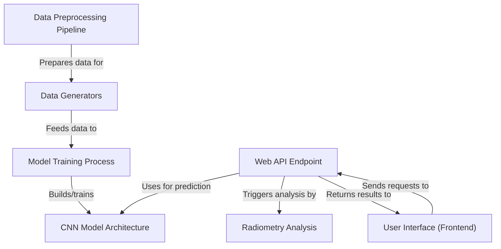
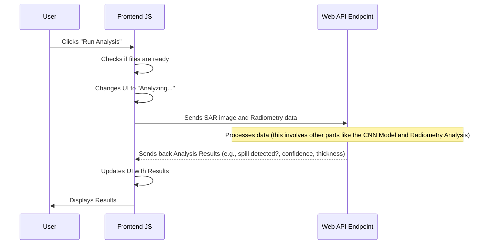
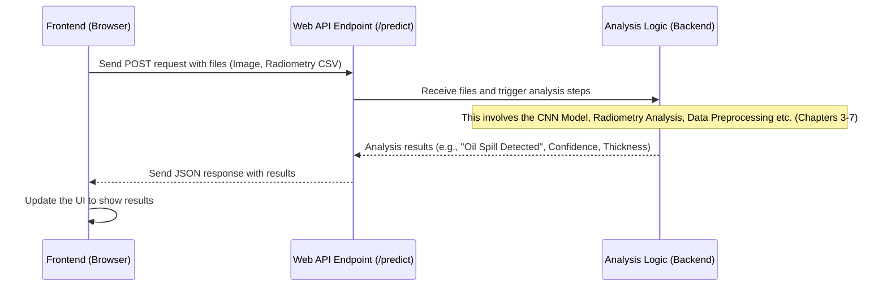
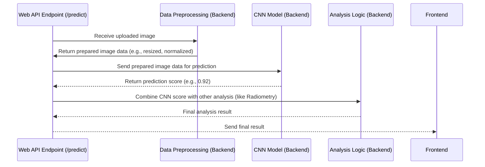
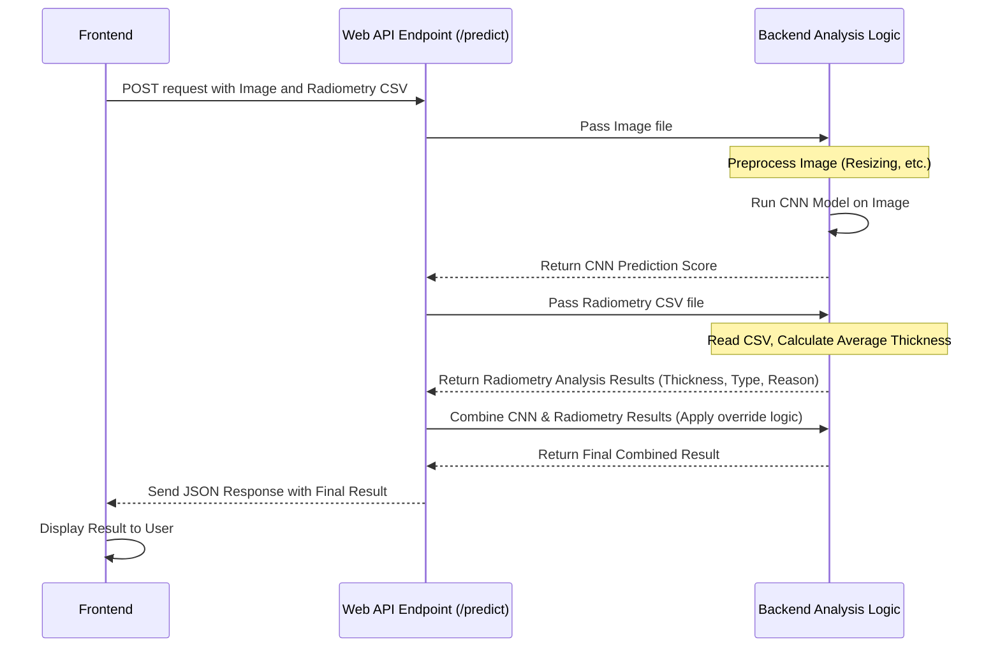
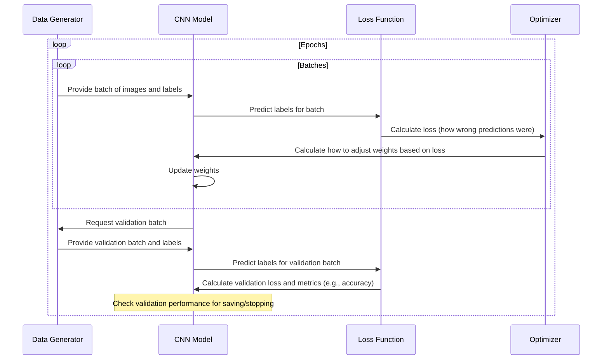
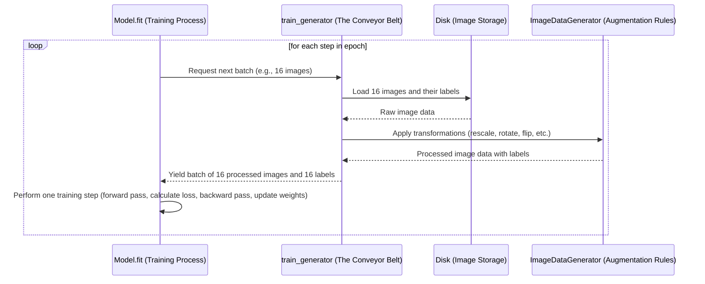
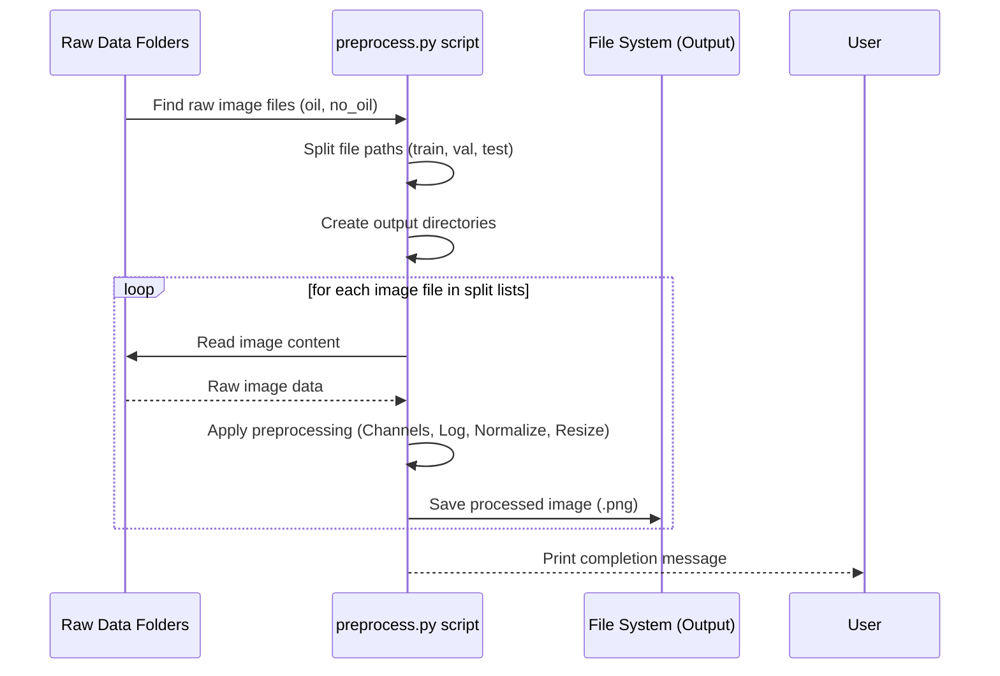

# Tutorial: Satellite-Based-Oil-Spill-Detection-Platform

This project is a platform to **detect oil spills** in satellite images.
It uses a **Data Preprocessing Pipeline** to prepare satellite images and data,
trains a **CNN Model** using **Data Generators**, hosts the trained model via a
**Web API Endpoint** that also performs **Radiometry Analysis** on additional data,
and presents the results through a friendly **User Interface**.


## Visual Overview



## Chapters

# Project Documentation Overview

## 1. User Interface (Frontend)

## 2. Web API Endpoint

## 3. CNN Model Architecture

## 4. Radiometry Analysis

## 5. Model Training Process

## 6. Data Generators

## 7. Data Preprocessing Pipeline

---
# Chapter 1: User Interface (Frontend)

Welcome to the first chapter of the tutorial for the Satellite-Based Oil Spill Detection Platform project!

When you use any app on your computer or phone, or visit a website, the first thing you see and interact with is the **User Interface**, often called the **Frontend**. Think of it as the "face" of the application. It's designed to be easy for *you*, the user, to understand and use.

In our Oil Spill Detection Platform, the Frontend is what you'll open in your web browser. It's where you'll:

*   See the welcome or login screen.
*   Find buttons to click and forms to fill out.
*   Upload the satellite images and data you want to analyze.
*   See messages telling you what the platform is doing.
*   Finally, view the results of the oil spill detection.

The Frontend's main job is to make the powerful technology behind the platform accessible and simple for you to use. It gathers your input (like the files you upload) and displays the output (the analysis results) in a clear way.

## Our Main Goal: Analyzing Data

The central task you'll perform with this platform is submitting satellite data to check for oil spills. Here's the basic flow from the Frontend's perspective:

1.  You open the platform in your browser.
2.  You might log in.
3.  You upload the necessary satellite image and radiometry data files using the interface.
4.  You click a button to start the analysis.
5.  The Frontend shows you that it's working.
6.  The Frontend receives the results and displays them to you.

Let's look at the different parts of our Frontend that make this happen.

## What You See: The Different Screens and Sections

The Frontend for our platform is built using standard web technologies: HTML (for the structure), CSS (for the look and style), and JavaScript (for making it interactive).

When you first open the application, you'll likely see a login screen.

### The Login Page

This is your entry point. It asks for a username and password.

```html
<!-- A simplified look at the login form part -->
<form class="login-form" id="loginForm">
    <div class="form-group">
        <label class="form-label" for="username">Username</label>
        <input type="text" id="username" class="form-input" placeholder="Enter your username" required>
    </div>

    <div class="form-group">
        <label class="form-label" for="password">Password</label>
        <input type="password" id="password" class="form-input" placeholder="Enter your password" required>
    </div>

    <button type="submit" class="login-btn">
        Sign In
    </button>
</form>
```

This small HTML snippet shows the form (`<form>`), input boxes (`<input>`) for username and password, and a button (`<button>`). These are the basic building blocks that allow you to provide information.

Behind the scenes, when you click "Sign In", some JavaScript code will take the username and password you entered and check if they are correct (in a real application, this check would happen on the server for security, but for this tutorial, it's simplified).

If the login is successful, the Frontend uses JavaScript to hide the login screen and show the main application screen.

### The Main Application Screen

Once logged in, you see the main interface, organized into different areas. The code uses CSS to arrange these areas nicely.

```html
<!-- Main Application Structure -->
<div class="app-container" id="mainApp">
    <!-- Header section -->
    <header class="app-header">
        <!-- Logo, Title, User Info, Logout Button -->
    </header>

    <!-- Main Content Area -->
    <main class="main-grid">
        <!-- Upload Panel -->
        <div class="upload-panel">
            <!-- File Upload Sections -->
        </div>

        <!-- Analysis Panel -->
        <div class="analysis-panel">
            <!-- Displays status or results -->
        </div>
    </main>
</div>
```

The `app-container` holds everything. Inside, there's a `header` at the top (showing the platform name, your user name, and a logout button) and the main content area (`main-grid`), which is split into two main parts using CSS grid layout: the "Upload Panel" and the "Analysis Panel".

The CSS file (`static/style.css` or the `<style>` block in `index.html`) contains rules that tell the browser how all these elements should look – their colors, spacing, fonts, and how they should be arranged on the screen.

```css
/* A very small example of CSS */
.login-btn {
    background: linear-gradient(135deg, var(--accent-primary), var(--accent-secondary));
    /* ... other styles like padding, border, etc. ... */
    cursor: pointer;
}

.login-btn:hover {
    transform: translateY(-2px);
    /* ... other hover styles ... */
}
```
This CSS rule snippet shows how the login button (`.login-btn`) gets its background color (a gradient!) and how it slightly moves up (`transform: translateY(-2px)`) when you hover your mouse over it (`:hover`). CSS handles all these visual details and animations.

## How You Interact: Uploading Files and Running Analysis

The key interactions happen in the "Upload Panel".

### Uploading Files

You need to provide two files: the SAR Image and the Radiometry Data (a CSV file).

```html
<!-- A simplified look at one upload section -->
<div class="upload-section">
    <label class="upload-label">SAR Satellite Image</label>
    <div class="upload-zone" id="sarUpload">
        <div class="upload-icon">...</div>
        <div class="upload-text" id="sarText">Click to upload or drag SAR image</div>
        <input type="file" id="sarFile" accept=".png,.jpg,.jpeg" style="display: none;">
    </div>
</div>
```

Here, the `upload-zone` is a special area. Even though there's an actual file input (`<input type="file">`), it's hidden (`style="display: none;"`). Instead, the JavaScript code makes the entire `upload-zone` clickable.

```javascript
// Small JavaScript snippet to make the upload zone clickable
document.getElementById('sarUpload').addEventListener('click', () => {
    document.getElementById('sarFile').click(); // When the zone is clicked, click the hidden file input
});

// And update the text when a file is selected
document.getElementById('sarFile').addEventListener('change', function (e) {
    const file = e.target.files[0];
    if (file) {
        document.getElementById('sarText').textContent = file.name; // Show the file name
        this.parentElement.classList.add('uploaded'); // Add a class to change its appearance
    }
});
```

This JavaScript listens for a `click` on the `sarUpload` area. When clicked, it triggers a click on the hidden file input (`sarFile`), which opens your computer's file explorer. When you select a file (the `change` event), another piece of JavaScript updates the text in the zone to show the file's name and changes the zone's style to show it's uploaded. Drag-and-drop also uses similar JavaScript magic.

### Running the Analysis

Once both files are uploaded, the "Run Analysis" button becomes active.

```html
<!-- The Analyze button -->
<button class="analyze-btn" id="analyzeBtn">
    <!-- SVG icon and text -->
    Run Analysis
</button>
```

Clicking this button is the trigger for the main action. The JavaScript code attached to this button does a few things:

1.  It checks if both files have been uploaded.
2.  It changes the button's text and style to show it's working (like showing a spinning icon).
3.  It hides the "Ready" state in the Analysis Panel.
4.  It shows the "Processing..." state in the Analysis Panel.
5.  Crucially, it gathers the uploaded files and sends them to the server for processing.

## What Happens When You Click "Run Analysis"? (Behind the Scenes)

When you click the "Run Analysis" button, the Frontend isn't doing the heavy-duty oil spill detection itself. That processing happens elsewhere. The Frontend's job is to package up the files you uploaded and send them to the part of the application that *can* do the analysis. This is done using something called a **Web API Endpoint**.

Think of the Web API Endpoint as a specific address on the server that is listening for requests from the Frontend. The Frontend sends a request to this address, including the uploaded files.

Here's a simplified sequence of events:



The JavaScript in the Frontend uses the `fetch` command to send the data to the server:

```javascript
// Snippet showing how Frontend JS sends data to the server
fetch("/predict", { // "/predict" is the Web API Endpoint address
    method: "POST", // We are sending data
    body: formData // The uploaded files are in 'formData'
})
.then(res => res.json()) // Expecting a JSON response back
.then(data => {
    // This code runs when the server sends back results
    console.log(data); // See what the server sent back
    showResult(data.prediction, data.reason, data.confidence, data.type); // Update the display
    // ... hide processing message, show results panel ...
})
.catch(err => {
    // This code runs if there was an error communicating
    console.error(err);
    // ... show an error message in the UI ...
});
```

This `fetch` call is the crucial bridge between the Frontend (what you see) and the backend (where the processing happens). The path `/predict` tells the Frontend *where* on the server to send the data. The `method: "POST"` means we are *sending* data to the server.

## Seeing the Results

Once the Frontend receives the analysis results back from the [Web API Endpoint](02_web_api_endpoint_.md), it updates the "Analysis Panel" to show this information.

```html
<!-- The Results State section -->
<div class="results-state" id="resultsState">
    <!-- Header, Status Card, Confidence Meter, Details, Stats -->
</div>
```

The Frontend JavaScript will take the data it received (like `"Oil Spill Detected"`, `"95%"`, `"Thick layer"`) and put those values into the correct places in the HTML elements (`#statusTitle`, `#confidenceValue`, `#thicknessValue`, etc.), often with some styling to make it clear (like changing colors based on confidence).

```javascript
function showResult(prediction, description, confidence, type) {
    // Update the main status text
    document.getElementById("statusTitle").textContent = prediction;
    document.getElementById("statusDescription").textContent = description;

    // Update the confidence value and bar width
    document.getElementById("confidenceValue").textContent = `${confidence}%`;
    document.getElementById("confidenceFill").style.width = `${confidence}%`;

    // ... code to update other details and change icon/color based on 'type' ...
}
```
This function `showResult` is called with the data received from the server. It finds specific HTML elements by their `id` (like `statusTitle`) and updates their content (`textContent`) or style (`style.width`). This is how the raw results data from the analysis gets transformed into a user-friendly display.

Finally, a "Start New Analysis" button appears, allowing you to clear the results and go back to the upload state, ready for another task.

## Summary

In this chapter, we learned that the User Interface (Frontend) is the visual and interactive part of our platform. It's built with HTML (structure), CSS (style), and JavaScript (interaction). We saw how it handles logging in, allowing users to upload the necessary satellite image and radiometry data files through simple click or drag-and-drop actions, triggering the analysis process, and finally displaying the results clearly to the user. The Frontend communicates with the rest of the application, which runs on a server, by sending requests to a specific address called a [Web API Endpoint](02_web_api_endpoint_.md).

The next chapter will dive into that exact concept: the [Web API Endpoint](02_web_api_endpoint_.md), and how it receives the request from the Frontend and acts as the gateway to the powerful analysis tools running on the server.

[Next Chapter: Web API Endpoint](02_web_api_endpoint_.md)

---
# Chapter 2: Web API Endpoint

Welcome back! In [Chapter 1: User Interface (Frontend)](01_user_interface__frontend__.md), we explored the "face" of our Oil Spill Detection Platform – what you see and interact with in your web browser. We learned that the Frontend is where you upload files and click the "Run Analysis" button. But we also saw that the Frontend doesn't do the complex analysis itself; it needs to send the data somewhere else for processing.

So, where does the Frontend send the data? It sends it to a specific address on the server, which is listening for requests. This specific address is called a **Web API Endpoint**.

## What is a Web API Endpoint?

Imagine you go to a restaurant. You don't go into the kitchen yourself to cook your food. Instead, you talk to the waiter. You tell the waiter what you want (this is your "request"). The waiter takes your request to the kitchen, and later brings your food back to you (this is the "response").

In our platform:

*   **You** are the user.
*   The **Frontend** is like the waiter. It takes your input (uploaded files) and your instruction ("Run Analysis").
*   The **Kitchen (Backend)** is where the actual work (oil spill analysis using models and data) happens.
*   The **Web API Endpoint** is like a specific window or door between the dining area (Frontend) and the kitchen (Backend) where the waiter knows exactly where to hand off your order and receive your food.

In technical terms, a **Web API Endpoint** is a specific URL (web address) on a server that your application's Frontend (or any other application) can send requests to and receive responses from. It's the entry point for communication with the server's backend logic.

For our Oil Spill Detection Platform, the main goal is to send the satellite image and radiometry data to the server for analysis. The Web API Endpoint is the designated spot on the server that is ready to receive this data and trigger the analysis process.

## Our Key Endpoint: `/predict`

In our project, the specific Web API Endpoint that handles the analysis request is located at the address `/predict`.

When you click "Run Analysis" in the Frontend, the JavaScript code we saw in [Chapter 1](01_user_interface__frontend__.md) prepares the uploaded files and sends them to this `/predict` endpoint on the server.

Why `/predict`? This name is chosen because the purpose of this endpoint is to take the input data and perform a "prediction" (whether or not there's an oil spill).

## How the Frontend Uses the Endpoint

Let's revisit that simplified JavaScript snippet from Chapter 1. This code runs in your browser when you click the analyze button:

```javascript
// Snippet from Frontend JS (likely in static/script.js or similar)
fetch("/predict", { // <-- This is where the endpoint is used!
    method: "POST", // We are SENDING data to the server
    body: formData  // 'formData' contains the uploaded files
})
.then(res => res.json()) // Process the response from the server
.then(data => {
    // This code runs when the server successfully sends back results
    console.log(data); // Shows the results in the browser's developer console
    showResult(data.prediction, data.reason, data.confidence, data.type); // Updates the UI
    // ... UI updates to show results ...
})
.catch(err => {
    // This code runs if there was an error communicating
    console.error(err);
    // ... UI updates to show an error message ...
});
```

*   `fetch("/predict", ...)`: This line tells the browser to make a request to the server at the `/predict` address.
*   `method: "POST"`: This is like telling the waiter *how* you are interacting. `POST` usually means you are sending data to the server to create or process something. Other common methods include `GET` (asking for data) or `DELETE` (asking to remove data). For sending our large files, `POST` is the right method.
*   `body: formData`: This is the actual data being sent – the uploaded image and CSV files, packaged up neatly.

So, the Frontend packages the data and the "instruction" (send this data to `/predict` using the `POST` method) and sends it off across the internet to the server.

## How the Backend "Hears" the Endpoint

On the server side, the application is constantly running, waiting for these requests to arrive at its endpoints. Our server application is built using a Python framework called **Flask**. Flask makes it easy to define these Web API Endpoints.

Here's how the `/predict` endpoint is set up in our `uploadmain.py` server file:

```python
# uploadmain.py
from flask import Flask, request, jsonify, render_template
# ... other imports ...

# Create a Flask application instance
app = Flask(
    __name__,
    template_folder="templates",
    static_folder="static"
)

# ... model loading ...

@app.route("/") # This defines the endpoint for the homepage (/)
def home():
    return render_template("index.html")

# This defines the endpoint for /predict
@app.route("/predict", methods=["POST"])
def predict():
    # This function runs when a POST request arrives at /predict
    print("Received request at /predict endpoint") # A message in the server console

    # We'll receive the uploaded files here...
    # ... and process them ...
    # ... and send back results ...

    return jsonify({ # Send back the results in JSON format
        "prediction": "Example Result",
        "confidence": 85.5,
        "thickness": "Thin layer",
        "reason": "Based on analysis",
        "oil_type": "Sheen"
    })

# ... rest of the script ...
if __name__ == "__main__":
    app.run(debug=True)

```

Let's break down the important parts for the endpoint:

1.  `from flask import Flask, request, jsonify, render_template`: We import necessary tools from the Flask library. `Flask` is the main application object, `request` helps us access incoming data, and `jsonify` helps send back data in a standard format.
2.  `app = Flask(...)`: This creates our web application instance.
3.  `@app.route("/predict", methods=["POST"])`: This is a special line (called a "decorator"). It tells Flask: "Whenever a request comes in for the `/predict` URL *and* that request uses the `POST` method, run the function right below me."
4.  `def predict():`: This is the Python function that gets executed. It contains all the logic for handling the request, processing the data, and preparing the response.

So, when the Frontend's `fetch` call sends a `POST` request to `/predict`, the Flask application on the server matches this request to the `@app.route("/predict", methods=["POST"])` decorator and executes the `predict()` function.

## What Happens Inside the `predict()` Function?

Once the request arrives at the `predict()` function, the server side takes over.

Think of the flow like this:



The `predict()` function in `uploadmain.py` is the starting point for the "Analysis Logic (Backend)". It does the following:

1.  **Receives the Files:** It uses `request.files` to access the image and radiometry CSV file that the Frontend sent.

    ```python
    # Inside the predict() function in uploadmain.py
    if 'image' not in request.files or 'radiometry' not in request.files:
        # Check if both files are present
        return jsonify({"error": "Both SAR image and radiometry CSV file are required"}), 400

    # Get the actual file objects from the request
    image_file = request.files['image']
    csv_file = request.files['radiometry']

    print(f"Received files: {image_file.filename}, {csv_file.filename}")
    # Now the function has access to the uploaded files
    ```
    The `request.files` object is like a dictionary where the keys (`'image'`, `'radiometry'`) are the names the Frontend used when sending the files, and the values are the file objects themselves.

2.  **Triggers Processing:** The function then contains the code to:
    *   Read and preprocess the SAR image (we'll cover this in [Chapter 7: Data Preprocessing Pipeline](07_data_preprocessing_pipeline_.md)).
    *   Pass the processed image to the [CNN Model (Chapter 3)](03_cnn_model_architecture_.md) for classification.
    *   Read and process the radiometry data (we'll cover this in [Chapter 4: Radiometry Analysis](04_radiometry_analysis_.md)).
    *   Combine the results from the CNN and radiometry analysis.

    ```python
    # Inside the predict() function in uploadmain.py
    # ... code to read image_file and csv_file ...

    # Example: Process the image (simplified)
    image = cv2.imdecode(np.frombuffer(image_file.read(), np.uint8), cv2.IMREAD_COLOR)
    processed_image = cv2.resize(image, (256, 256)) # Simplified preprocessing

    # Example: Use the Model (simplified)
    prediction_score = model.predict(np.expand_dims(processed_image/255.0, axis=0))[0][0]
    confidence = round(float(prediction_score) * 100, 2)

    # Example: Process radiometry data (simplified)
    df = pd.read_csv(csv_file)
    avg_thickness = df['Thickness'].mean() if 'Thickness' in df.columns else 0
    thickness = "Thick layer" if avg_thickness > 50 else "Thin layer" # Simplified logic

    # Determine final outcome...
    final_label = "Oil Spill Detected" if confidence >= 50 and avg_thickness > 0 else "No Oil Spill Found" # Very simplified logic
    reason = "Analysis complete"

    # ... more complex logic for combining results happens here ...
    ```
    *Note: The actual `predict()` function in `uploadmain.py` is a bit longer because it includes the real logic for image reading, resizing, model prediction, CSV reading, calculating thickness, and cross-checking the results. We've broken it down and simplified parts here for clarity in this chapter.*

3.  **Sends Back the Response:** Finally, after all the analysis is done, the `predict()` function prepares the results (like "Oil Spill Detected", the confidence score, and the thickness analysis) and sends them back to the Frontend. This is typically done in a structured data format like **JSON** (JavaScript Object Notation), which is easy for both the server and the Frontend JavaScript to read.

    ```python
    # Inside the predict() function in uploadmain.py
    # ... after performing all analysis and getting results ...

    return jsonify({
        "prediction": final_label, # e.g., "Oil Spill Detected"
        "confidence": confidence,   # e.g., 92.5
        "thickness": thickness,     # e.g., "Moderate layer"
        "reason": reason,         # e.g., "High confidence based on CNN and radiometry"
        "oil_type": oil_type      # e.g., "Diesel or Lubricant Oil"
    })
    ```
    The `jsonify()` function takes a Python dictionary and turns it into a JSON response that the Frontend can understand.

The Frontend's `fetch` call receives this JSON response (`.then(res => res.json())`) and then uses that data to update what you see on the screen (`showResult(data.prediction, ...)`).

## Summary

In this chapter, we learned about the **Web API Endpoint**. It's the specific "door" or address on the server (`/predict` in our case) where the Frontend sends its requests (like "Analyze these files!") and receives responses (the analysis results). We saw how the Frontend uses the `fetch` command to send a `POST` request to this endpoint and how the backend, built with Flask, uses the `@app.route` decorator to listen for requests at that specific address and execute a Python function (`predict()`) to handle the request, perform the analysis, and send back the results in JSON format.

The Web API Endpoint acts as the crucial link between the user-facing part of the application (the Frontend) and the powerful processing logic that runs on the server (the Backend).

Now that we know *where* the files go on the server, let's start looking at *how* the server processes the main input: the satellite image. The next chapter will introduce the [CNN Model Architecture](03_cnn_model_architecture_.md) which is a key part of analyzing the image data.

[Next Chapter: CNN Model Architecture](03_cnn_model_architecture_.md)


# Chapter 3: CNN Model Architecture

Welcome to Chapter 3! In the previous chapters, we explored the [User Interface (Frontend)](01_user_interface__frontend__.md), which is what you see and interact with, and the [Web API Endpoint](02_web_api_endpoint_.md), which is the "door" on the server that receives your request to analyze data.

Now that your satellite image has arrived at the server via the Web API, how does the platform actually *look* at that image and figure out if there's an oil spill? This is where the **CNN Model Architecture** comes in.

## What is a CNN Model?

Think of the CNN Model as the "visual expert" or the "brain" of our platform specifically designed to understand images. Its main job is to look at the satellite picture you uploaded and decide, based on what it sees, whether an oil spill is likely present or not.

CNN stands for **Convolutional Neural Network**. That sounds complicated, but let's break it down with an analogy:

Imagine you're teaching a child to recognize different objects, like a cat. You show them many pictures of cats. At first, they might just see fur and whiskers. As they learn, they start recognizing features like pointed ears, a tail, and maybe how the nose looks. Eventually, they can combine these features to confidently say, "That's a cat!"

A CNN works similarly with images, but instead of recognizing cats, it's looking for patterns related to oil spills in satellite images. It does this by processing the image through a series of layers, each layer helping it understand more complex patterns.

## Why Do We Need a CNN for Oil Spills?

Satellite images can contain many different things: water, land, clouds, ships, and sometimes, oil spills. Oil spills often have distinct visual characteristics in certain types of satellite images (like SAR images – we'll discuss *why* in the [Radiometry Analysis](04_radiometry_analysis_.md) chapter). They might appear as smooth, dark areas on the water surface.

A CNN is perfect for this task because it's built to automatically learn and detect these specific visual patterns directly from the image data, without us having to manually tell it exactly what pixels to look for.

**The central use case for the CNN model is: Given a satellite image segment, classify it as either containing an 'Oil Spill' or 'No Oil Spill'.**

Let's see how it does this by looking at its architecture, layer by layer.

## Building Blocks of a CNN

A CNN is built by stacking different types of layers on top of each other. Data (the image) flows through these layers, and each layer transforms the data to extract more meaningful information.

Here are the main types of layers you'll find in our CNN architecture:

1.  **Convolutional Layers (`Conv2D`):** These are the core "filters". They scan the image looking for simple patterns like edges, lines, or textures. Imagine shining different kinds of patterned light onto parts of the image and seeing what lights up.
    *   Our model uses `Conv2D` layers. The number inside (like 32, 64) represents the number of different filters it applies.
    *   They often work with an **Activation Function** (`Activation('relu')`) right after them. This adds non-linearity, helping the network learn more complex things than just straight lines. Think of ReLU as a simple switch: if the signal is positive, let it pass; otherwise, block it.

2.  **Pooling Layers (`MaxPooling2D`):** These layers act like "summarizers". After a convolutional layer finds patterns, the pooling layer shrinks the image representation while keeping the most important information (like the strongest detected patterns). This helps reduce the amount of data and makes the model less sensitive to the exact position of patterns.
    *   `MaxPooling2D` is a common type that essentially takes the maximum value from small regions, effectively summarizing that region.

3.  **Batch Normalization Layers (`BatchNormalization`):** These layers help stabilize and speed up the training process. They essentially normalize the output of previous layers, preventing some training problems.

4.  **Flatten Layer (`Flatten`):** After several convolutional and pooling layers, the data is still in a 2D or 3D grid format. The `Flatten` layer takes this grid and turns it into a single long list of numbers. This is necessary to prepare the data for the final decision-making layers.

5.  **Dense (Fully Connected) Layers (`Dense`):** These are the final "decision-makers". They take the flattened list of features (the summarized patterns) and use them to make the final classification decision.
    *   The last `Dense` layer usually has a specific **Activation Function** (`activation='sigmoid'`) for binary classification. The sigmoid function squashes the output into a value between 0 and 1, which we can interpret as a probability (e.g., 0.9 means 90% probability of being an oil spill).

6.  **Dropout Layers (`Dropout`):** These layers are used during training to randomly ignore a fraction of the neurons in the previous layer. This prevents the model from relying too heavily on specific patterns and helps it generalize better to new, unseen images.

## How Our CNN is Built (Code Walkthrough)

Let's look at the Python code that defines our CNN architecture in the `train.py` file. The function `create_cnn_model` builds the model using the layers described above.

```python
# From train.py
from tensorflow.keras.models import Sequential
from tensorflow.keras.layers import Conv2D, MaxPooling2D, BatchNormalization
from tensorflow.keras.layers import Activation, Dropout, Flatten, Dense

def create_cnn_model(input_shape=(256, 256, 3)):
    """Create a CNN model for oil spill detection"""
    model = Sequential() # We build the model layer by layer

    # --- First convolutional block ---
    model.add(Conv2D(32, (3, 3), input_shape=input_shape, padding='same'))
    model.add(BatchNormalization())
    model.add(Activation('relu'))
    model.add(MaxPooling2D(pool_size=(2, 2)))
    # This block applies 32 filters, normalizes, applies ReLU, and then summarizes

    # --- Second convolutional block ---
    model.add(Conv2D(64, (3, 3), padding='same')) # Now applies 64 filters
    model.add(BatchNormalization())
    model.add(Activation('relu'))
    model.add(MaxPooling2D(pool_size=(2, 2)))
    # This block looks for slightly more complex patterns and summarizes again

    # --- Third convolutional block ---
    model.add(Conv2D(128, (3, 3), padding='same')) # Applies 128 filters
    model.add(BatchNormalization())
    model.add(Activation('relu'))
    model.add(MaxPooling2D(pool_size=(2, 2)))
    # More filters to find even more complex patterns

    # --- Fourth convolutional block ---
    model.add(Conv2D(256, (3, 3), padding='same')) # Applies 256 filters
    model.add(BatchNormalization())
    model.add(Activation('relu'))
    model.add(MaxPooling2D(pool_size=(2, 2)))
    # Finding even more detailed patterns

    # --- Fully connected layers (Decision Makers) ---
    model.add(Flatten()) # Turns the 2D grid into a 1D list of features
    model.add(Dense(512)) # A dense layer with 512 'neurons'
    model.add(BatchNormalization())
    model.add(Activation('relu'))
    model.add(Dropout(0.5)) # Randomly ignore 50% of neurons during training

    model.add(Dense(1, activation='sigmoid'))  # Final dense layer: 1 neuron, outputs probability (0 to 1)

    return model
```

Let's look at the first few lines inside the function:

```python
# From train.py
model = Sequential() # We build the model layer by layer

# --- First convolutional block ---
model.add(Conv2D(32, (3, 3), input_shape=input_shape, padding='same'))
model.add(BatchNormalization())
model.add(Activation('relu'))
model.add(MaxPooling2D(pool_size=(2, 2)))
```

*   `model = Sequential()`: This creates an empty model where we can add layers one after another, in sequence.
*   `model.add(...)`: This is how we add a layer to the model.
*   `Conv2D(32, (3, 3), ...)`: Adds a convolutional layer with 32 filters, each being 3x3 pixels in size. `input_shape` tells it the expected size of the input images (256x256 pixels with 3 color channels, like RGB).
*   `BatchNormalization()`: Adds a normalization layer.
*   `Activation('relu')`: Adds the ReLU activation function.
*   `MaxPooling2D(pool_size=(2, 2))`: Adds a pooling layer that shrinks the output by taking the maximum value over 2x2 regions.

The following blocks (`Second`, `Third`, `Fourth`) repeat this pattern, but with more filters (64, 128, 256). This allows the network to detect increasingly complex patterns as the data passes through.

After these convolutional and pooling layers, the code adds the `Flatten` and `Dense` layers:

```python
# From train.py
# --- Fully connected layers (Decision Makers) ---
model.add(Flatten()) # Turns the 2D grid into a 1D list of features
model.add(Dense(512)) # A dense layer with 512 'neurons'
model.add(BatchNormalization())
model.add(Activation('relu'))
model.add(Dropout(0.5)) # Randomly ignore 50% of neurons during training

model.add(Dense(1, activation='sigmoid'))  # Final dense layer: 1 neuron, outputs probability (0 to 1)
```

*   `model.add(Flatten())`: This prepares the output from the last pooling layer for the dense layers.
*   `model.add(Dense(512))`: This adds a dense layer with 512 neurons (like mini-decision units).
*   `model.add(Dropout(0.5))`: This adds the dropout layer to help with training stability.
*   `model.add(Dense(1, activation='sigmoid'))`: This is the *final* layer. It has only 1 neuron because we want a single output: the probability of an oil spill. The `sigmoid` activation ensures this output is between 0 (no spill) and 1 (definite spill).

Putting it all together, the image goes through these steps:
1.  **Filtered:** Simple patterns are detected across the image.
2.  **Summarized:** The important patterns are kept, and the image representation shrinks.
3.  **Repeated:** This filtering and summarizing happens multiple times, finding more complex patterns.
4.  **Flattened:** The final pattern summary is converted into a list.
5.  **Decided:** Dense layers look at the pattern list and output a final probability score for "Oil Spill".

## How the Web API Endpoint Uses the CNN

Remember the `predict()` function in our `uploadmain.py` from [Chapter 2: Web API Endpoint](02_web_api_endpoint_.md)? That function is responsible for taking the uploaded image and feeding it into this CNN model to get the prediction.

Here's a simplified flow:



The `predict()` function in `uploadmain.py` first loads the saved CNN model:

```python
# From uploadmain.py
from tensorflow.keras.models import load_model

# ... other imports ...

# Load the model when the server starts
# Make sure you have a trained model file (e.g., oil_spill_model.h5)
try:
    MODEL_PATH = 'models/oil_spill_model.h5' # Assuming the trained model is here
    model = load_model(MODEL_PATH)
    print(f"Model loaded successfully from {MODEL_PATH}")
except Exception as e:
    print(f"Error loading model: {e}")
    model = None # Set model to None if loading fails

# ... Flask app setup ...

@app.route("/predict", methods=["POST"])
def predict():
    if model is None:
        return jsonify({"error": "Model not loaded"}), 500

    # ... code to receive and process image file ...

    # Use the loaded model to make a prediction
    # The processed_image needs to be the right shape and type
    # Example (simplified):
    img_array = np.expand_dims(processed_image, axis=0) # Add a batch dimension
    prediction_score = model.predict(img_array)[0][0] # Get the single prediction value

    # prediction_score is a number between 0 and 1
    confidence = round(float(prediction_score) * 100, 2) # Convert to percentage

    # ... rest of the predict function logic ...

    return jsonify({
        # ... results including confidence ...
    })

```

Inside the `predict()` function, after processing the image, it uses `model.predict(img_array)` to get the CNN's output. `img_array` is the prepared image data, ready for the model. The model returns a value (or values) based on its last layer. Since our last layer has 1 neuron with a sigmoid activation, it returns a single probability score between 0 and 1.

```python
# Example output from model.predict on one image:
# [[0.92345]]

# Getting the score:
prediction_score = model.predict(img_array)[0][0] # This would be 0.92345
confidence = round(float(prediction_score) * 100, 2) # This would be 92.35
```

This prediction score is then used by the rest of the backend logic (which might also look at the [Radiometry Analysis](04_radiometry_analysis_.md)) to make the final decision and determine the confidence level, which is then sent back to the Frontend.

## Summary

In this chapter, we explored the **CNN Model Architecture**, which acts as the visual expert of our platform. We learned that it's built from stacked layers – **Convolutional** (for finding patterns), **Pooling** (for summarizing), **Batch Normalization** (for stability), **Flatten** (for preparing data), and **Dense** (for making the final decision). We saw how the `create_cnn_model` function in `train.py` defines this structure using `tensorflow.keras`. Finally, we understood how the `predict()` function in the [Web API Endpoint](02_web_api_endpoint_.md) loads this trained model and uses its `predict` method to get a probability score from the satellite image, which is a crucial step in detecting oil spills.

While the CNN is great at looking at the *shape* and *texture* in the image, satellite data often contains other valuable information, like radiometry, which measures signal intensity. The next chapter will delve into [Radiometry Analysis](04_radiometry_analysis_.md) and how it complements the CNN's visual analysis.

[Next Chapter: Radiometry Analysis](04_radiometry_analysis_.md)

# Chapter 4: Radiometry Analysis

Welcome back! In the previous chapters, we journeyed through the project's layers. We started with the [User Interface (Frontend)](01_user_interface__frontend__.md) – what you see and click on. Then we moved to the [Web API Endpoint](02_web_api_endpoint_.md), the "door" on the server that receives your uploaded files. In [Chapter 3: CNN Model Architecture](03_cnn_model_architecture_.md), we learned how our "visual expert" (the CNN) looks at the satellite *image* to detect patterns indicating oil.

But what if the satellite provides more than just a picture? What if it also gives us separate numerical measurements? This is where **Radiometry Analysis** comes in.

## What Problem Does Radiometry Analysis Solve?

Imagine you're trying to identify something tricky, like whether a coin is fake. You might look at its appearance (like the image expert does) – does it look right? Does the pattern match? But you might *also* weigh it or measure its thickness, comparing those numbers to known values for a real coin.

Our CNN is like the "look expert" for the satellite image. It's great at spotting the *visual signature* of an oil spill. However, sometimes other things can look similar (like calm water or algae). Also, just looking at the image doesn't tell you *how thick* the oil layer might be, which is important information.

This is where Radiometry Analysis helps. Satellites, especially SAR (Synthetic Aperture Radar) satellites used for this kind of detection, collect numerical data about the intensity of the radar signal reflected back from the Earth's surface. This data, called **radiometry data**, can be analyzed to get different insights.

**The central use case for Radiometry Analysis in our platform is: Use the separate numerical radiometry data to provide additional confirmation and details (like estimated thickness) about a potential oil spill, acting as a second opinion alongside the CNN.**

Think of the radiometry data as the "measurements" for our oil spill detection. While the CNN looks at the picture, the radiometry analysis looks at the numbers associated with the signal intensity. Oil on water affects this radar signal differently depending on its thickness and type, which is why analyzing this data can give us unique information.

## What is Radiometry Data in Our Project?

In our platform, the radiometry data is typically provided as a separate file, often in a **CSV (Comma Separated Values) format**. This file contains rows of numbers, where each row might correspond to a specific point or area in the satellite image, and columns represent different measurements or properties derived from the sensor signal.

One key piece of information often included in this radiometry data, and which is crucial for our analysis, is an estimate of the **thickness** of any detected surface film. Specialized processing (often done before the data gets to our platform) uses the radiometric values to calculate this thickness.

So, while the CNN gets a grid of pixels (the image), the Radiometry Analysis gets a table of numbers, like this simplified example:

| PointID | Latitude | Longitude | RadiometricValue | **Thickness** |
| :------ | :------- | :-------- | :--------------- | :------------ |
| 1       | 34.05    | -118.25   | 0.12             | 0             |
| 2       | 34.05    | -118.26   | 0.08             | 0             |
| 3       | 34.06    | -118.25   | 0.45             | 15            |
| 4       | 34.06    | -118.26   | 0.78             | 65            |
| 5       | 34.07    | -118.25   | 0.31             | 30            |

Our focus in this chapter is specifically on the `Thickness` column.

## How Radiometry (Thickness) Analysis Helps

Analyzing the `Thickness` values from the radiometry data provides several benefits:

1.  **Confirmation:** If the CNN detects a potential spill, finding non-zero thickness values in the corresponding radiometry data provides strong supporting evidence.
2.  **Differentiation:** Radiometry can help distinguish between thin oil sheens, thicker crude oil spills, or even non-oil phenomena that look visually similar in the image. Different thicknesses often correlate with different types of oil.
3.  **Detailed Information:** The thickness value provides a quantitative measure that the image alone cannot easily give. This information is valuable for response efforts.

Our platform uses the average thickness calculated from the provided radiometry data as a key factor in the final determination and description of the spill.

## Performing the Radiometry Analysis (Code Walkthrough)

Let's look at how our `uploadmain.py` script, which handles the [Web API Endpoint](02_web_api_endpoint_.md), performs the radiometry analysis.

Remember the `predict()` function from Chapter 2? It receives both the image and the CSV file. After processing the image and getting the CNN result, it processes the CSV file for radiometry analysis.

Here's the part of the `predict()` function that handles the radiometry data:

```python
# From uploadmain.py
# ... code to handle image and run CNN model ...

# ----------- Handle Radiometry CSV ----------
csv_file = request.files['radiometry'] # Get the CSV file from the request
try:
    df = pd.read_csv(csv_file) # Read the CSV file into a pandas DataFrame

    # Check if the 'Thickness' column exists in the data
    if 'Thickness' in df.columns:
        # Calculate the average thickness from the column
        avg_thickness = df['Thickness'].mean()

        # Now, categorize the thickness based on the average value
        if avg_thickness > 50:
            thickness = "Thick layer"
            reason = "High thickness value indicates a strong presence of oil."
            oil_type = "Crude Oil or Emulsified Oil"
            thickness_flag = "high" # Internal flag for logic
        elif 20 < avg_thickness <= 50:
            thickness = "Moderate layer"
            reason = "Moderate thickness suggests a medium oil spread."
            oil_type = "Diesel or Lubricant Oil"
            thickness_flag = "moderate"
        elif 0 < avg_thickness <= 20:
            thickness = "Thin layer"
            reason = "Low thickness points to a light oil film."
            oil_type = "Sheen or Light Oil"
            thickness_flag = "low"
        else: # avg_thickness is 0 or negative
            thickness = "None"
            reason = "Zero thickness indicates no visible oil layer."
            oil_type = "None"
            thickness_flag = "none"
    else:
        # Handle the case where the required column is missing
        thickness = "Unknown"
        reason = "Missing 'Thickness' column in radiometry data."
        oil_type = "Unknown"
        thickness_flag = "unknown"

except Exception as e:
    # Handle any errors during file reading or processing
    thickness = "Error"
    reason = f"Failed to read radiometry file: {str(e)}"
    oil_type = "Unknown"
    thickness_flag = "unknown"

# ... rest of the predict function logic ...
```

Let's break this down:

1.  `csv_file = request.files['radiometry']`: This line gets the uploaded radiometry file object from the incoming request.
2.  `df = pd.read_csv(csv_file)`: This is where the magic happens using the `pandas` library (a powerful tool for data analysis in Python). `pd.read_csv()` reads the content of the uploaded file and organizes it neatly into a **DataFrame**, which is like a table.
3.  `if 'Thickness' in df.columns:`: It checks if a column named 'Thickness' exists in the table.
4.  `avg_thickness = df['Thickness'].mean()`: If the column exists, it selects that specific column (`df['Thickness']`) and calculates the average (`.mean()`) of all the numbers in that column.
5.  `if/elif/else` block: This part of the code checks the calculated `avg_thickness` and assigns a descriptive text (`thickness`), a `reason`, and an estimated `oil_type` based on predefined ranges (e.g., > 50 means "Thick layer", likely Crude Oil). It also sets an internal `thickness_flag` for simpler logic later.
6.  `except Exception as e:`: This is error handling. If anything goes wrong while reading or processing the CSV (e.g., it's not a valid CSV), it catches the error and sets the results to "Error" or "Unknown".

So, this block of code takes the raw numbers from the CSV, finds the average thickness, and translates that number into human-readable categories like "Thin layer" or "Thick layer".

## How the Analyses are Combined

After getting the prediction from the CNN *and* the results from the Radiometry Analysis, the `predict()` function needs to combine them to give a final result.

In our current `uploadmain.py` code, the radiometry analysis is given a high level of importance. The presence of any detected thickness (`thickness_flag` is not "none") is used to potentially override the CNN's prediction.

```python
# From uploadmain.py
# ... code for CNN prediction and Radiometry Analysis ...

# ----------- Override Based on Cross-Check ----------
# If radiometry detected ANY thickness, we'll flag it as a spill
if thickness_flag in ["moderate", "high", "low"]:
    final_label = "Oil Spill Detected"
    # We might also adjust confidence or reason here based on both...
    # For simplicity, the code just sets the final label and keeps the CNN confidence.
    # The 'reason' and 'oil_type' come from the radiometry analysis in this simplified logic.
else:
    # If radiometry found no thickness, the final label depends on other factors
    # In this simple version, if radiometry is 'none', we stick to 'No Oil Spill Found'.
    # A more complex version might use the CNN confidence here.
    final_label = "No Oil Spill Found"


# ----------- Response JSON ----------
# Prepare the final response using combined results
return jsonify({
    "prediction": final_label,      # Final decision after cross-check
    "confidence": confidence,       # CNN confidence (could be adjusted)
    "thickness": thickness,         # From radiometry analysis
    "reason": reason,             # From radiometry analysis or combined logic
    "oil_type": oil_type          # From radiometry analysis
})
```

This snippet shows a simple logic: if the radiometry analysis calculated an average thickness greater than zero (`thickness_flag` is "low", "moderate", or "high"), the system concludes "Oil Spill Detected". Otherwise, it concludes "No Oil Spill Found". The final response then includes the CNN's confidence score *and* the detailed results from the radiometry analysis (thickness description, reason, oil type).

This demonstrates how the two distinct types of analysis provide complementary information. The CNN gives a visual probability, while the radiometry analysis provides numerical confirmation and detail about the spill characteristics.

Here's the overall flow within the backend:



## Summary

In this chapter, we explored **Radiometry Analysis**, a crucial part of our platform that complements the visual analysis done by the CNN. We learned that radiometry data provides numerical measurements from the satellite, often in a CSV file, and that the estimated **thickness** of a potential oil film is a key piece of information derived from it. We saw how the `predict()` function in our [Web API Endpoint](02_web_api_endpoint_.md) uses the `pandas` library to read the radiometry CSV, calculate the average thickness, and categorize it. Finally, we understood how this radiometry analysis is combined with the CNN's visual prediction to produce a more robust and detailed final result, providing both a detection decision and characteristics like thickness and oil type.

Now that we've covered how the image and radiometry data are processed and analyzed, you might wonder how the CNN model (which is central to the image analysis) actually *learns* to detect oil spills in the first place. The next chapter will dive into the [Model Training Process](05_model_training_process_.md).

[Next Chapter: Model Training Process](05_model_training_process_.md)

# Chapter 5: Model Training Process

Welcome back! In the last chapter, [Chapter 4: Radiometry Analysis](04_radiometry_analysis_.md), we learned how numerical data from the satellite, like estimated oil thickness, provides valuable supporting evidence for our detection. We also saw how our "visual expert," the [CNN Model Architecture](03_cnn_model_architecture_.md), looks at the image itself.

But where does this CNN model get its expertise? How does it learn what an oil spill looks like versus just ordinary water or clouds? This is where the **Model Training Process** comes in.

## What Problem Does Model Training Solve?

Think about teaching a computer to recognize handwritten digits (like 0 through 9). You can't just give it a set of rules like "if it has a loop at the top and a straight line down, it's a 9." Handwritten digits vary *hugely*! Instead, you show it *thousands* of examples of each digit, each labeled correctly ("this is a 0", "this is a 1", etc.). As it sees more examples, it gradually learns the complex patterns that define each digit.

Our CNN model for oil spill detection faces a similar challenge. Oil spills appear in different shapes, sizes, lighting conditions, and against different water backgrounds. Manually writing rules for every possibility is impossible.

**The central use case for the Model Training Process is: Teach the CNN model to automatically recognize and classify satellite image segments as either 'Oil Spill' or 'No Oil Spill' by showing it many examples of each.**

Training is essentially teaching the model to become an expert by learning from experience (the training data).

## What is Model Training?

Model training is an iterative process where the model is exposed to a large dataset of examples, makes predictions, compares its predictions to the correct answers, and adjusts its internal settings to get better over time.

Imagine the CNN model is a student learning to identify oil spills.

1.  **Show Examples:** You show the student (the model) a picture from your collection (the training data). You also tell them the correct answer: "This picture shows an oil spill."
2.  **Student Guesses:** The student looks at the picture and makes a guess: "Is this an oil spill? I think... maybe 70% likely?" (The model outputs a probability).
3.  **Give Feedback:** You compare the student's guess to the correct answer you gave them earlier ("Oil Spill"). You tell them how wrong their guess was (this is calculated by a **Loss Function**). If they guessed 70% and the answer was 'Oil Spill' (which we can think of as 100%), they were pretty close. If they guessed 10% and the answer was 'Oil Spill', they were very wrong.
4.  **Student Adjusts:** Based on how wrong they were, the student figures out *how* to adjust their thinking (the model adjusts its internal parameters, called **weights** and **biases**, using an **Optimizer** algorithm). The goal is to make their next guess better.
5.  **Repeat:** You repeat this whole process (steps 1-4) with another picture, and another, and another, many thousands or millions of times, until the student (model) becomes very good at identifying oil spills on its own.

This entire cycle, showing data, guessing, getting feedback, and adjusting, is the core of model training.

## Key Components of the Training Process

Several elements are crucial for successful training:

*   **Training Data:** This is the collection of images with their corresponding correct labels ('Oil Spill' or 'No Oil Spill'). Quality and quantity of this data are key.
*   **Model Architecture:** The structure of the CNN we discussed in [Chapter 3: CNN Model Architecture](03_cnn_model_architecture_.md) determines what kind of patterns the model *can* learn.
*   **Loss Function:** A mathematical formula that calculates how 'wrong' the model's prediction is for a given example. For binary classification (spill or no spill), `binary_crossentropy` is commonly used. Lower loss means better prediction.
*   **Optimizer:** An algorithm (like Adam, SGD) that uses the loss value to figure out how to adjust the model's internal weights to reduce the loss in the future.
*   **Metrics:** Measurements used to evaluate the model's performance during training, such as **Accuracy** (percentage of correct guesses).
*   **Epochs:** One full pass through the *entire* training dataset. Training usually takes many epochs.
*   **Batch Size:** How many images are shown to the model at once before it calculates the average loss and adjusts its weights. Training happens in small groups (batches) rather than one image at a time.
*   **Validation Data:** A separate set of labeled images that the model *does not* train on. This is used to check if the model is truly learning to identify spills generally, or just memorizing the training examples (called overfitting).
*   **Callbacks:** Helper tools that run during training to perform actions like saving the model, stopping training early if it's not improving, or adjusting the learning rate.

## The Training Loop (Conceptual Flow)

Here's a simplified view of the training loop:



## Training the Model (Code Walkthrough)

The training process in our project is handled by the `train.py` script. Specifically, the `train_model` function orchestrates the entire process.

First, the script creates the model architecture using the function we saw in [Chapter 3](03_cnn_model_architecture_.md):

```python
# From train.py

def train_model(epochs=50, batch_size=16, lr=0.001):
    """Train the CNN model"""
    # Create model
    model = create_cnn_model()

    # ... rest of the function ...
```

Next, before training starts, the model needs to be "compiled". This step configures the model's learning process by specifying the optimizer, the loss function, and the metrics to track.

```python
# From train.py

def train_model(epochs=50, batch_size=16, lr=0.001):
    # ... create model ...

    # Compile model
    model.compile(
        optimizer=Adam(learning_rate=lr), # How the model adjusts weights
        loss='binary_crossentropy',       # How 'wrong' the model is for binary tasks
        metrics=['accuracy']              # How we measure performance
    )

    # ... rest of the function ...
```

*   `model.compile(...)`: This is the command to configure the model for training.
*   `optimizer=Adam(...)`: We choose the Adam optimizer, a popular and effective algorithm for adjusting weights. `learning_rate` controls how big of a step the optimizer takes when adjusting weights.
*   `loss='binary_crossentropy'`: We use binary crossentropy because this is a binary classification problem (Oil Spill or No Oil Spill).
*   `metrics=['accuracy']`: We tell the model to calculate and report the accuracy during training.

The data is fed to the model using **Data Generators**. These are set up next (we will dive into them in the next chapter, [Chapter 6: Data Generators](06_data_generators_.md)).

```python
# From train.py

def train_model(epochs=50, batch_size=16, lr=0.001):
    # ... create model ...
    # ... compile model ...

    # Create data generators (details in next chapter)
    train_generator, val_generator, test_generator = create_data_generators(batch_size)

    # ... rest of the function ...
```

The `create_data_generators` function loads images from folders (like `data/processed/train`, `data/processed/val`) and prepares them in batches, also applying techniques like data augmentation to make the training data more diverse.

Finally, the core training command is called: `model.fit()`.

```python
# From train.py

def train_model(epochs=50, batch_size=16, lr=0.001):
    # ... create model, compile model, create generators ...

    # Create callbacks (optional helpers)
    checkpoint = ModelCheckpoint(...) # Saves the best model
    early_stopping = EarlyStopping(...) # Stops training if not improving
    reduce_lr = ReduceLROnPlateau(...) # Adjusts learning rate

    callbacks = [checkpoint, early_stopping, reduce_lr] # List of callbacks to use

    # Train model!
    print("Starting model training...")
    history = model.fit(
        train_generator, # Data to train on
        steps_per_epoch=len(train_generator), # How many batches in one epoch
        epochs=epochs,   # How many full passes through the data
        validation_data=val_generator, # Data to validate on
        validation_steps=len(val_generator), # How many batches for validation
        callbacks=callbacks, # Use our helper tools
        verbose=1 # Show progress during training
    )

    # ... save model, plot history, evaluate test set ...
```

*   `model.fit(...)`: This is the main command that starts the training loop.
*   `train_generator`: Provides the training data in batches.
*   `epochs`: Specifies how many times the training loop should run through the entire training dataset (in batches). Here, it's set to 50.
*   `validation_data=val_generator`: Provides the validation data. The model's performance is checked on this data at the end of each epoch.
*   `callbacks=callbacks`: We pass the list of helper tools (Checkpoint, Early Stopping, etc.) that we want to run during training.

When you run the `train.py` script, this `model.fit()` call will execute. You will see output in your console showing the progress for each epoch: the loss and accuracy on the training data, and the loss and accuracy on the validation data. The goal is to see the accuracy increase and the loss decrease over epochs, especially on the validation data.

The callbacks help manage this process:
*   `ModelCheckpoint`: It watches the `val_accuracy` (accuracy on validation data) and saves the model's weights whenever it finds a new highest validation accuracy. This ensures you keep the model that performed best on unseen data.
*   `EarlyStopping`: It watches the `val_loss` (loss on validation data). If the validation loss stops improving for a certain number of epochs (`patience`), it stops training early. This saves time and prevents overfitting.
*   `ReduceLROnPlateau`: If the validation loss plateaus (stops decreasing) for a few epochs, it reduces the learning rate (`lr`) slightly. This can sometimes help the optimizer find a better minimum in the loss.

After all epochs complete (or training is stopped early), the `model.fit()` function finishes, and the script saves the best-performing model file (e.g., `models/oil_spill_model_timestamp.h5`) and plots the training history (accuracy and loss curves over epochs). This saved `.h5` file contains all the learned weights and biases – the "knowledge" the model gained during training.

This `.h5` file is the crucial output of the training process. This is the file that the [Web API Endpoint](02_web_api_endpoint_.md) (specifically the `predict()` function in `uploadmain.py`) loads to perform oil spill detection on new, unseen images uploaded by the user.

```python
# From uploadmain.py (revisiting Chapter 2 code)
from tensorflow.keras.models import load_model

# ... other imports ...

# Load the trained model when the server starts
try:
    MODEL_PATH = 'models/oil_spill_model.h5' # Assuming the best model was saved/copied here
    model = load_model(MODEL_PATH) # Loads the learned knowledge
    print(f"Model loaded successfully from {MODEL_PATH}")
except Exception as e:
    print(f"Error loading model: {e}")
    model = None

# ... Flask app setup and predict function ...
```
This `load_model(MODEL_PATH)` call loads the saved "brain" of the model, including all the weights adjusted during training. When a new image arrives via the endpoint, `model.predict()` uses this learned knowledge to make its guess.

## Summary

In this chapter, we explored the **Model Training Process**. We learned that it's how our [CNN Model Architecture](03_cnn_model_architecture_.md) gains the ability to detect oil spills by repeatedly learning from labeled examples of images with and without spills. We discussed the key components: the **training data**, **loss function**, **optimizer**, and **metrics**. We saw how the `train.py` script orchestrates this using `model.compile` to set up the learning rules and `model.fit` to run the training loop for a set number of **epochs**, using **Data Generators** to feed batches of data and **Callbacks** to manage the process and save the best result based on **validation data**. The output of this process is a saved model file containing the learned parameters, which is then loaded by the [Web API Endpoint](02_web_api_endpoint_.md) to make predictions on new data.

Feeding the model data efficiently during training is a crucial task. The next chapter will delve into [Data Generators](06_data_generators_.md) and how they handle this, especially when dealing with large datasets.

[Next Chapter: Data Generators](06_data_generators_.md)

# Chapter 6: Data Generators

Welcome to Chapter 6! In the last chapter, [Chapter 5: Model Training Process](05_model_training_process_.md), we learned how our [CNN Model Architecture](03_cnn_model_architecture_.md) learns to detect oil spills by repeatedly looking at examples of images. We saw the `model.fit()` command that kicks off this learning process.

But imagine you have thousands, or even millions, of satellite images needed for training. If your computer tried to load all those images into its memory (RAM) at once, it would likely run out of space and crash!

This is where **Data Generators** come in.

## What Problem Do Data Generators Solve?

Think of your computer's memory like a desk. If you're working on a big project with thousands of papers (images), you can't possibly put all of them on your desk at the same time. You'd have papers spilling everywhere!

Model training needs access to the data, but doesn't need *all* of it *right now*. It just needs a small stack of papers (a **batch** of images) to work on for one training step. Once it's done with that stack, it needs the *next* stack.

**The central use case for Data Generators is: Efficiently provide batches of images and their corresponding labels to the model during training and evaluation without loading the entire dataset into memory.**

Data Generators solve the problem of handling large datasets by acting like a smart assistant who manages the stacks of papers for you.

## What is a Data Generator?

Instead of loading everything at once, a Data Generator is like a **smart conveyor belt**. When the training process needs a batch of images, it asks the generator, and the generator loads *just* that required batch from storage (like your hard drive), prepares it, and sends it to the model. Once that batch is used, the generator gets ready to load the *next* batch when asked.

Here's why they are important:

*   **Memory Efficiency:** They only load small batches into memory at any given time. Essential for large datasets.
*   **On-the-Fly Processing:** They can perform transformations on the images *as* they are loaded, like resizing, rotating, or zooming. This is great for [Data Preprocessing](07_data_preprocessing_pipeline_.md) and especially for **Data Augmentation**.
*   **Integration:** They work seamlessly with the `fit()`, `evaluate()`, and `predict()` methods of models in libraries like TensorFlow/Keras.

## Key Concepts with Our Data Generators

Our project uses the `ImageDataGenerator` class from Keras, which is perfect for image datasets organized in folders. It introduces a few key ideas:

1.  **`ImageDataGenerator` (The Blueprint):** This is not the generator itself, but rather a class that defines *how* to generate data. You set parameters here like how to rescale pixel values, or what kind of random changes (augmentation) to apply to images during training.
2.  **`flow_from_directory` (The Actual Conveyor Belt):** This method, when called on an `ImageDataGenerator` instance, creates the actual Python generator object. It reads images from specified directories and automatically infers the class label based on the folder name containing the image (e.g., images in a folder named `oil_spill` get the 'Oil Spill' label).
3.  **Batch Size:** A parameter you set for `flow_from_directory`. It determines how many images are included in each batch the generator yields.
4.  **Data Augmentation:** Random transformations (rotations, shifts, flips, zooms, etc.) applied to the training images *every time* they are loaded. This makes the model see slightly different versions of the same image, helping it learn more robust features and prevent **overfitting** (where the model memorizes the training data instead of learning general patterns).

## How Our Project Uses Data Generators (Code Walkthrough)

In our `train.py` script, the `create_data_generators` function is responsible for setting up these conveyor belts.

```python
# From train.py

from tensorflow.keras.preprocessing.image import ImageDataGenerator

def create_data_generators(batch_size=16):
    """Create data generators for training, validation, and testing"""

    # 1. Define the blueprint for training data (with augmentation)
    train_datagen = ImageDataGenerator(
        rescale=1.0/255, # Rescale pixel values from 0-255 to 0-1
        rotation_range=15, # Randomly rotate images by up to 15 degrees
        width_shift_range=0.1, # Randomly shift images horizontally
        height_shift_range=0.1, # Randomly shift images vertically
        shear_range=0.1,   # Apply shear transformation
        zoom_range=0.1,    # Randomly zoom in/out
        horizontal_flip=True, # Randomly flip images horizontally
        vertical_flip=True,   # Randomly flip images vertically
        fill_mode='nearest' # How to fill in pixels after transformations
    )

    # 2. Define blueprints for validation/test data (rescaling only - no augmentation)
    val_datagen = ImageDataGenerator(rescale=1.0/255)
    test_datagen = ImageDataGenerator(rescale=1.0/255)

    # ... continue below ...
```

Here, we first create three `ImageDataGenerator` objects:
*   `train_datagen`: Includes all the augmentation parameters. This ensures the training data is varied on every epoch.
*   `val_datagen`: Only includes `rescale=1.0/255`. We don't use augmentation on validation or test data because we want to evaluate the model on realistic images, not randomly transformed ones. Rescaling is part of standard [Data Preprocessing](07_data_preprocessing_pipeline_.md).
*   `test_datagen`: Same as `val_datagen`.

Next, we use `flow_from_directory` on each blueprint to create the actual generator objects:

```python
# From train.py (continued)

def create_data_generators(batch_size=16):
    # ... define datagen blueprints ...

    # 3. Create the actual generators using flow_from_directory
    train_generator = train_datagen.flow_from_directory(
        'data/processed/train', # Path to the training data directory
        target_size=(256, 256), # Resize images to this size
        batch_size=batch_size,  # Number of images per batch (e.g., 16)
        class_mode='binary',    # Since we have 2 classes (spill/no spill)
        shuffle=True            # Randomly shuffle the training data each epoch
    )

    val_generator = val_datagen.flow_from_directory(
        'data/processed/val', # Path to the validation data directory
        target_size=(256, 256),
        batch_size=batch_size,
        class_mode='binary',
        shuffle=False           # Don't shuffle validation data
    )

    test_generator = test_datagen.flow_from_directory(
        'data/processed/test', # Path to the test data directory
        target_size=(256, 256),
        batch_size=batch_size,
        class_mode='binary',
        shuffle=False           # Don't shuffle test data
    )

    # 4. Return the generators
    return train_generator, val_generator, test_generator

# Example console output when flow_from_directory runs:
# Found 1200 images belonging to 2 classes. # (for train_generator)
# Found 300 images belonging to 2 classes.  # (for val_generator)
# Found 500 images belonging to 2 classes.  # (for test_generator)
```

The `flow_from_directory` method is quite smart:
*   It looks inside the specified path (`data/processed/train`, etc.).
*   It expects to find subfolders within that path. Each subfolder name is treated as a class label. For example, if you have `data/processed/train/oil_spill` and `data/processed/train/no_oil_spill`, it finds two classes.
*   It reads all the image files (like `.png`, `.jpg`) within those subfolders.
*   `target_size=(256, 256)` ensures all images are resized to a consistent size required by our [CNN Model Architecture](03_cnn_model_architecture_.md).
*   `batch_size` sets the number of images per batch.
*   `class_mode='binary'` tells it that there are only two possible outcomes (oil spill or not), so it should provide labels as 0s and 1s suitable for binary classification.
*   `shuffle=True` is important for training data to mix up the order of images. `shuffle=False` is used for validation and test data to ensure consistent evaluation.

These three generator objects (`train_generator`, `val_generator`, `test_generator`) are what our `train_model` function passes to the `model.fit()` method.

## How `model.fit()` Uses the Generators

Remember the `model.fit()` call from [Chapter 5: Model Training Process](05_model_training_process_.md)?

```python
# From train.py (simplified model.fit)

# Train model!
print("Starting model training...")
history = model.fit(
    train_generator, # Data to train on, provided batch by batch
    steps_per_epoch=len(train_generator), # How many batches make one epoch
    epochs=epochs,   # How many full passes through the data
    validation_data=val_generator, # Data to validate on, provided batch by batch
    validation_steps=len(val_generator), # How many batches for validation
    callbacks=callbacks, # Use our helper tools
    verbose=1 # Show progress during training
)
```

Instead of giving `model.fit()` a giant array of all images, we give it the `train_generator`.

*   `model.fit()` knows it needs to go through the entire training dataset for each epoch.
*   It repeatedly asks `train_generator` for the "next batch" until the generator indicates it has provided all images in the dataset (across multiple batches).
*   The total number of batches needed to cover the entire dataset once is `steps_per_epoch`. The length of a generator (`len(train_generator)`) automatically calculates this based on the total number of images and the `batch_size`.
*   The same process happens for `validation_data` using the `val_generator`.

## Data Generator Internal Workflow (Conceptual)

Here's a simple sequence showing how the generator works when `model.fit` requests a batch:



In essence, the generator reads images in chunks (batches) from the disk *as needed*, applies the defined processing and augmentation rules, and then provides the ready batch to the model for one step of training. This avoids flooding the computer's memory.

## Summary

In this chapter, we tackled the challenge of feeding potentially large image datasets to our [CNN Model Architecture](03_cnn_model_architecture_.md) during the [Model Training Process](05_model_training_process_.md). We learned that **Data Generators** act as efficient managers, providing data in small batches on demand, like a smart conveyor belt. We explored how `ImageDataGenerator` defines the rules (including **Data Augmentation**), and `flow_from_directory` creates the actual generator that loads images from folders, infers labels, resizes, and yields batches. This approach is crucial for memory efficiency and helps the model learn robust patterns by seeing varied versions of the training images.

These data generators also perform initial processing like rescaling the pixel values. The next chapter will look more broadly at the entire [Data Preprocessing Pipeline](07_data_preprocessing_pipeline_.md) that prepares both image and radiometry data before it's used by the model or for analysis.

[Next Chapter: Data Preprocessing Pipeline](07_data_preprocessing_pipeline_.md)

# Chapter 7: Data Preprocessing Pipeline

Welcome to the final chapter of our tutorial for the Satellite-Based Oil Spill Detection Platform! In the last chapter, [Chapter 6: Data Generators](06_data_generators_.md), we saw how Data Generators efficiently feed batches of images to our model during training without overwhelming memory.

But before those generators can even *start* feeding images, the raw satellite data needs to be cleaned up and made ready. Think of it like preparing ingredients before cooking a meal. You wouldn't throw raw, unwashed vegetables and uncooked meat straight into a pot! You wash, peel, chop, and measure everything first.

This is exactly what the **Data Preprocessing Pipeline** does for our satellite data.

## What Problem Does Data Preprocessing Solve?

Satellite images come in various formats, sizes, and raw pixel value ranges. They might contain noise or characteristics that aren't ideal for an AI model to learn from directly. Radiometry data also needs to be parsed from its raw format (like a CSV file).

Our [CNN Model Architecture](03_cnn_model_architecture_.md) expects images in a very specific, consistent format: all the same size (e.g., 256x256 pixels), with pixel values in a certain range (e.g., 0 to 1), and possibly with specific transformations applied that highlight relevant features. Raw data doesn't meet these requirements.

**The central use case for the Data Preprocessing Pipeline is: Take raw, unprocessed satellite image and radiometry data and transform it into a clean, standardized format that is ready for the AI model to use for training or prediction, and for analysis scripts to easily read.**

This pipeline ensures that all data fed into the system is consistent and optimized for the subsequent analysis steps.

## Key Steps in the Preprocessing Pipeline

Our data preprocessing pipeline involves several steps, primarily focusing on the satellite images used for CNN training. The radiometry data also needs processing, but it's simpler (just reading the CSV, as seen in [Chapter 4: Radiometry Analysis](04_radiometry_analysis_.md)).

For the images, the main steps handled by the `preprocess.py` script are:

1.  **Organizing Output:** Create folders to store the processed images, separated into training, validation, and testing sets, and within those, folders for 'oil' and 'no_oil' classes.
2.  **Reading Images:** Load images from various potential file formats (like `.jpg`, `.tif`, `.jp2`).
3.  **Handling Channels:** Ensure images have the expected number of color channels (e.g., convert grayscale SAR images to a format compatible with CNNs expecting multiple channels).
4.  **Applying Transformations:** Apply specific image enhancements like a **log transform**, which is common for SAR images to make features more visible.
5.  **Normalizing Pixel Values:** Scale the raw pixel values into a standard range (like 0 to 1). This helps the model learn effectively.
6.  **Resizing Images:** Change all images to a consistent target size (e.g., 256x256 pixels) required by the model.
7.  **Splitting Data:** Divide the dataset into subsets for training, validation, and testing the model.
8.  **Saving Processed Images:** Save the transformed images in a common format (like PNG) to the organized output folders.

## Preprocessing the Dataset (Code Walkthrough: `preprocess.py`)

The script `preprocess.py` implements the main preprocessing pipeline for the dataset used for training the CNN. It's typically run *once* before you start the [Model Training Process](05_model_training_process_.md).

First, it sets up the output folder structure:

```python
# From preprocess.py
import os
# ... other imports ...

def create_directories(output_dir='data/processed'):
    """Create necessary directories for processed data"""
    print(f"Creating directories in {output_dir}...")
    os.makedirs(os.path.join(output_dir, 'train/oil'), exist_ok=True)
    os.makedirs(os.path.join(output_dir, 'train/no_oil'), exist_ok=True)
    os.makedirs(os.path.join(output_dir, 'val/oil'), exist_ok=True)
    os.makedirs(os.path.join(output_dir, 'val/no_oil'), exist_ok=True)
    os.makedirs(os.path.join(output_dir, 'test/oil'), exist_ok=True)
    os.makedirs(os.path.join(output_dir, 'test/no_oil'), exist_ok=True)
    print("Directories created.")

# This function just ensures these folders exist before saving files into them.
# 'exist_ok=True' means it won't complain if the folders are already there.
```

Next, functions to read and preprocess individual images are defined. `read_image` handles different formats:

```python
# From preprocess.py
import cv2 # OpenCV library for image processing
import numpy as np
# ... other imports ...

def read_image(file_path):
    """Read image (handle .jpg, .tif, etc.)"""
    try:
        print(f"Reading {file_path}...")
        if file_path.lower().endswith('.jpg'):
            # Read JPG as grayscale (common for single-band SAR converted to JPG)
            image = cv2.imread(file_path, cv2.IMREAD_GRAYSCALE)
            if image is not None:
                # Add a channel dimension to make it (height, width, 1)
                image = np.expand_dims(image, axis=-1)
            return image
        elif file_path.lower().endswith(('.tif', '.tiff', '.jp2')):
            # Use rasterio for multi-band formats (if needed)
            # This part might require installing rasterio: pip install rasterio
            # For simplicity, assume we only use JPG for this tutorial's dataset structure
            print(f"Warning: Advanced format {file_path}. Assuming simple JPG input for this example.")
            # In a real project, you'd read multi-band data here...
            # image = read_multiband_image_with_rasterio(file_path)
            return None # Returning None for unsupported simple example
        else:
            print(f"Unsupported file type: {file_path}")
            return None
    except Exception as e:
        print(f"Error reading {file_path}: {e}")
        return None

# This function tries to read the image file.
# It handles JPGs specifically and adds a channel dimension.
# More complex formats like TIFF or JP2 often contain multiple bands (channels)
# and would require libraries like rasterio, but for simplicity, we focus on JPGs here.
```

The core `preprocess_image` function applies the necessary transformations:

```python
# From preprocess.py
# ... imports and read_image function ...

def preprocess_image(image, size=(256, 256)):
    """Preprocess SAR image (log transform, resize, normalize, handle channels)"""
    if image is None:
        print("Cannot preprocess None image.")
        return None

    print(f"Preprocessing image with shape {image.shape}...")

    # Step 1: Handle channels - ensure image has 3 channels for compatibility with CNN
    if len(image.shape) == 2:  # Grayscale image (height, width)
        # Stack the single channel three times to create a (height, width, 3) image
        # This is often done to use pre-trained models or standard CNN architectures
        image = np.stack([image, image, image], axis=-1)
        print(f"  - Converted grayscale to 3 channels, new shape {image.shape}")
    elif image.shape[-1] == 1: # Image is (height, width, 1)
         # Stack the single channel three times
        image = np.stack([image[:,:,0], image[:,:,0], image[:,:,0]], axis=-1)
        print(f"  - Converted 1 channel to 3 channels, new shape {image.shape}")
    # Note: If image already has 3 channels (or more), we might select channels or use as is.
    # For simplicity, we assume input is grayscale or 1-channel.


    # Step 2: Log transform - enhances contrast, especially useful for SAR data
    epsilon = 1e-6  # Small value to avoid log(0)
    # Apply logarithm to pixel values (add epsilon to avoid log of zero)
    log_image = np.log(image.astype(np.float32) + epsilon)
    print("  - Applied log transform")


    # Step 3: Normalize to 0-1 range
    min_val = np.min(log_image)
    max_val = np.max(log_image)
    # Ensure max != min to avoid division by zero if image is uniform
    if max_val - min_val > 0:
        normalized = (log_image - min_val) / (max_val - min_val)
    else:
        normalized = np.zeros_like(log_image) # Handle uniform image case
    print("  - Normalized to 0-1 range")


    # Step 4: Resize image to target size (e.g., 256x256)
    # Ensure image is in correct format for cv2.resize (uint8 or float32)
    resized = cv2.resize(normalized, size)
    print(f"  - Resized to {size}, final shape {resized.shape}")

    return resized

# This function is the core image transformer.
# 1. It makes sure the image has 3 color channels, which is standard for many CNNs.
# 2. It applies a log transform, a mathematical function that can make dark areas brighter
#    and compress bright areas, often revealing details in SAR images.
# 3. It scales all pixel values to be between 0 and 1.
# 4. It resizes the image to the exact dimensions the CNN expects.
```

The `process_dataset` function orchestrates the reading, splitting, processing, and saving:

```python
# From preprocess.py
# ... imports, create_directories, read_image, preprocess_image ...
from sklearn.model_selection import train_test_split # Tool to split data
import glob # Tool to find files using patterns

def process_dataset(oil_dir, no_oil_dir, output_dir='data/processed', test_size=0.2, val_size=0.2):
    """Process the dataset, split into train/val/test sets, and save"""
    create_directories(output_dir)

    # Step 1: Find all image files in the raw data directories
    print(f"Looking for images in {oil_dir} and {no_oil_dir}...")
    oil_files = glob.glob(os.path.join(oil_dir, '*.jpg')) # Find all JPGs in oil dir
    no_oil_files = glob.glob(os.path.join(no_oil_dir, '*.jpg')) # Find all JPGs in no_oil dir
    # Add other formats if needed, e.g., + glob.glob(os.path.join(oil_dir, '*.tif')) etc.

    print(f"Found {len(oil_files)} oil spill images and {len(no_oil_files)} non-oil spill images")

    # Step 2: Split the file lists into training, validation, and testing sets
    # First split off test_size + val_size into a temporary set
    oil_train, oil_temp = train_test_split(oil_files, test_size=(test_size + val_size), random_state=42)
    # Then split the temporary set into validation and test sets
    oil_val, oil_test = train_test_split(oil_temp, test_size=(test_size / (test_size + val_size)), random_state=42)

    # Repeat for non-oil images
    no_oil_train, no_oil_temp = train_test_split(no_oil_files, test_size=(test_size + val_size), random_state=42)
    no_oil_val, no_oil_test = train_test_split(no_oil_temp, test_size=(test_size / (test_size + val_size)), random_state=42)

    print(f"Splitting data: Train ({len(oil_train)} oil, {len(no_oil_train)} no-oil), "
          f"Val ({len(oil_val)} oil, {len(no_oil_val)} no-oil), "
          f"Test ({len(oil_test)} oil, {len(no_oil_test)} no-oil)")

    # Step 3: Process and save images for each split
    process_images_list(oil_train, os.path.join(output_dir, 'train/oil'), 'oil')
    process_images_list(oil_val, os.path.join(output_dir, 'val/oil'), 'oil')
    process_images_list(oil_test, os.path.join(output_dir, 'test/oil'), 'oil')

    process_images_list(no_oil_train, os.path.join(output_dir, 'train/no_oil'), 'no_oil')
    process_images_list(no_oil_val, os.path.join(output_dir, 'val/no_oil'), 'no_oil')
    process_images_list(no_oil_test, os.path.join(output_dir, 'test/no_oil'), 'no_oil')

    print("Dataset processing completed")

# This function manages the whole dataset preprocessing:
# 1. It finds all the raw image files for oil and no-oil categories.
# 2. It uses `train_test_split` to randomly divide the list of files into three groups:
#    training (the largest), validation (for checking during training), and testing (for final evaluation).
# 3. It then calls another helper function (`process_images_list`) for each of these groups.
```

The `process_images_list` helper function loops through a list of files, calls `read_image` and `preprocess_image`, and saves the result:

```python
# From preprocess.py
# ... imports and other functions ...

def process_images_list(file_list, output_dir, prefix):
    """Process and save a list of images"""
    os.makedirs(output_dir, exist_ok=True) # Ensure output directory exists

    print(f"Processing {len(file_list)} images for {output_dir}...")
    for i, file_path in enumerate(file_list):
        # Read the image using the function defined earlier
        image = read_image(file_path)

        if image is not None:
            # Preprocess the image using the function defined earlier
            processed = preprocess_image(image)

            if processed is not None:
                # Save the processed image as a PNG file
                # Convert the 0-1 float image back to 0-255 integers for saving as PNG
                output_path = os.path.join(output_dir, f"{prefix}_{i:04d}.png")
                cv2.imwrite(output_path, (processed * 255).astype(np.uint8))
                # print(f"  Saved -> {output_path}") # Uncomment for detailed progress
            else:
                print(f"Failed to preprocess {file_path}")
        else:
            print(f"Failed to read {file_path}")
    print(f"Finished processing images for {output_dir}")

# This function takes a list of file paths and:
# 1. Loops through each file.
# 2. Reads the image content.
# 3. Applies the preprocessing steps (channel handling, log transform, normalize, resize).
# 4. Saves the final processed image in PNG format in the correct output folder.
```

When you run the `preprocess.py` script, it executes the `if __name__ == "__main__":` block:

```python
# From preprocess.py
# ... all functions defined above ...

if __name__ == "__main__":
    # !!! UPDATE THESE PATHS TO POINT TO YOUR RAW DATA !!!
    # Example: If your raw oil images are in C:\data\raw\oil
    oil_dataset_dir = r"path/to/your/raw/oil/images"
    no_oil_dataset_dir = r"path/to/your/raw/no_oil/images"

    # Run the main processing function
    process_dataset(oil_dataset_dir, no_oil_dataset_dir)

# This is the starting point when you run the script.
# You MUST update the 'oil_dataset_dir' and 'no_oil_dataset_dir'
# variables to point to where your raw oil and no-oil images are stored on your computer.
# Then it calls the process_dataset function to begin the pipeline.
```

After running `preprocess.py`, you will have a new directory structure under `data/processed` containing all your images, resized to 256x256 pixels, log-transformed, normalized to 0-1 (then scaled to 0-255 for saving as PNG), and organized into train, validation, and test folders for oil and no-oil classes.

```
data/
└── processed/
    ├── test/
    │   ├── no_oil/
    │   │   └── no_oil_0000.png
    │   │   └── ...
    │   └── oil/
    │       └── oil_0000.png
    │       └── ...
    ├── train/
    │   ├── no_oil/
    │   │   └── no_oil_xxxx.png
    │   │   └── ...
    │   └── oil/
    │       └── oil_xxxx.png
    │       └── ...
    └── val/
        ├── no_oil/
        │   └── no_oil_yyyy.png
        │   └── ...
        └── oil/
            └── oil_yyyy.png
            └── ...
```

This `data/processed` directory is the crucial output that the [Data Generators](06_data_generators_.md) use during the [Model Training Process](05_model_training_process_.md). The generators read the images from these specific folders, and because they are already preprocessed, the generators primarily need to worry about creating batches and applying *augmentation* (random variations) for the training set.

## Preprocessing for Prediction (Single Image)

When a user uploads a *single* image via the [User Interface (Frontend)](01_user_interface__frontend__.md), it gets sent to the [Web API Endpoint](02_web_api_endpoint_.md) (`/predict`). This single image also needs preprocessing before it can be fed into the trained [CNN Model Architecture](03_cnn_model_architecture_.md) for prediction.

The preprocessing steps for a single image are similar to the dataset preprocessing, but without the splitting and saving to folders:

1.  Read the uploaded image file.
2.  Handle channels (e.g., ensure 3 channels).
3.  Apply the same transformations (like log transform).
4.  Normalize pixel values.
5.  Resize the image to the model's input size (e.g., 256x256).

This is handled directly within the `predict()` function in `uploadmain.py`:

```python
# From uploadmain.py (simplified snippet from Chapter 2)
# ... imports and model loading ...

@app.route("/predict", methods=["POST"])
def predict():
    # ... receive image_file and csv_file from request ...

    # Read the image file content into memory
    image_bytes = image_file.read()
    # Convert the bytes to a numpy array, then decode as an image
    # Assuming the uploaded image is a color or grayscale image readable by cv2
    np_img = np.frombuffer(image_bytes, np.uint8)
    uploaded_image = cv2.imdecode(np_img, cv2.IMREAD_COLOR) # Read as color by default

    if uploaded_image is None:
         return jsonify({"error": "Failed to read uploaded image"}), 400

    # --- Preprocess the single uploaded image ---
    # Note: This calls similar logic to preprocess_image from preprocess.py
    # but without the log transform for general uploaded images (SAR specific)
    # For SAR JPGs, you might apply log transform here too depending on source
    # Example: Convert to grayscale and then to 3 channels if it's a SAR JPG
    # If it's a general image, maybe just resize and normalize
    
    # Simple example: Resize and normalize for a general image
    target_size = (256, 256)
    resized_image = cv2.resize(uploaded_image, target_size)

    # Ensure 3 channels even if input was grayscale
    if len(resized_image.shape) == 2:
        resized_image = np.stack([resized_image, resized_image, resized_image], axis=-1)
        
    # Normalize pixel values from 0-255 to 0-1
    normalized_image = resized_image.astype(np.float32) / 255.0

    # The model expects a batch, so add a batch dimension
    img_array = np.expand_dims(normalized_image, axis=0) # Shape becomes (1, 256, 256, 3)

    # --- Feed the prepared image to the model ---
    prediction_score = model.predict(img_array)[0][0]
    confidence = round(float(prediction_score) * 100, 2)

    # ... rest of the predict function logic (radiometry, combining results) ...
```

The `predict()` function uses `cv2.imdecode` to read the image from the bytes received in the request, then applies resizing and normalization. For SAR images specifically, you would also apply the log transform here if the input format benefits from it, just like in `preprocess.py`. The important part is that the single image goes through a transformation process to match the format the model was *trained* on.

## Preprocessing Workflow (Dataset)

Here's a visual summary of the dataset preprocessing pipeline implemented in `preprocess.py`:



This pipeline ensures that the data is consistently formatted and organized, which is essential for training a robust model.

## Radiometry Data Preprocessing

As mentioned, radiometry data also needs processing. In our project, this means reading the CSV file, which we covered in [Chapter 4: Radiometry Analysis](04_radiometry_analysis_.md) using the `pandas` library. The `predict()` function in `uploadmain.py` directly reads the uploaded CSV and extracts the necessary 'Thickness' column. If the CSV data required cleaning or transformation (e.g., handling missing values, converting units), those steps would also be part of the radiometry preprocessing within that function. However, compared to image preprocessing, reading structured data like CSVs is generally more straightforward.

## Summary

In this final chapter, we explored the **Data Preprocessing Pipeline**. We learned that it's like preparing ingredients before cooking, taking raw satellite data (images and radiometry) and transforming it into a clean, standardized format ready for the AI model and analysis. We saw how the `preprocess.py` script implements this pipeline for the training dataset, handling different file formats, image channels, applying transformations like log scaling, normalizing pixel values, resizing images, and splitting the data into train/validation/test sets before saving the results. We also briefly touched upon how a similar preprocessing step is applied to a single uploaded image by the [Web API Endpoint](02_web_api_endpoint_.md) before it's fed to the trained model. This preprocessing is a fundamental step that ensures the quality and consistency of the data used throughout the entire oil spill detection platform.

This chapter concludes our tutorial series on the core components of the Satellite-Based Oil Spill Detection Platform. We've journeyed from the user interface and web API, through the CNN model and radiometry analysis, understanding how data is generated, trained, and finally preprocessed. These components work together seamlessly to provide a powerful tool for identifying potential oil spills from space.
