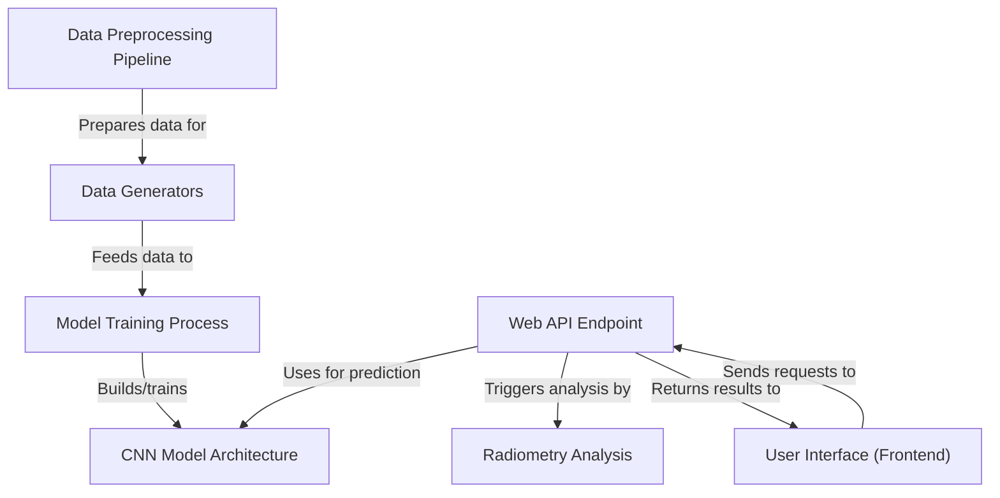

# Tutorial: Satellite-Based-Oil-Spill-Detection-Platform

This project is a platform to **detect oil spills** in satellite images.
It uses a **Data Preprocessing Pipeline** to prepare satellite images and data,
trains a **CNN Model** using **Data Generators**, hosts the trained model via a
**Web API Endpoint** that also performs **Radiometry Analysis** on additional data,
and presents the results through a friendly **User Interface**.

## Visual Overview

## Chapters

1. [User Interface (Frontend)
](01_user_interface__frontend__.md)
2. [Web API Endpoint
](02_web_api_endpoint_.md)
3. [CNN Model Architecture
](03_cnn_model_architecture_.md)
4. [Radiometry Analysis
](04_radiometry_analysis_.md)
5. [Model Training Process
](05_model_training_process_.md)
6. [Data Generators
](06_data_generators_.md)
7. [Data Preprocessing Pipeline
](07_data_preprocessing_pipeline_.md)

---
